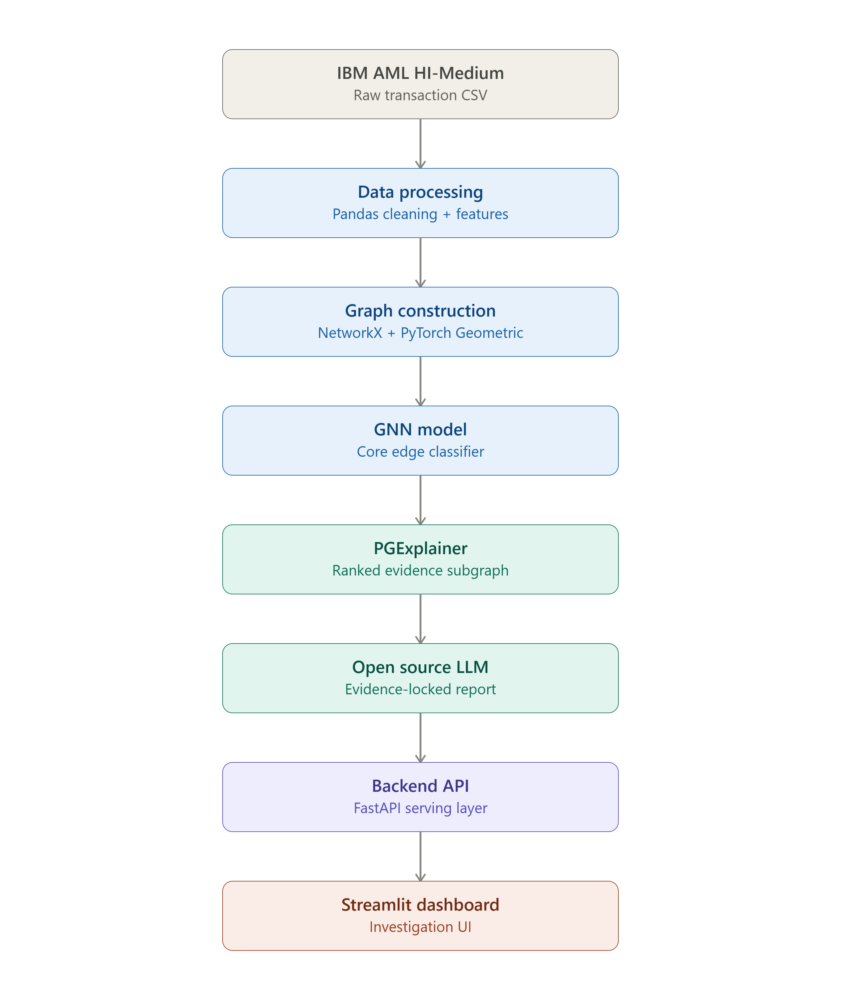

# AML-GNN-LLM-Explainer
> M.S. in Computer Science — Master Project

## 📋 Project Overview
This project builds an explainable AI system that uses Large Language Models (LLMs) to generate human-readable explanations for Graph Neural Network (GNN) predictions in Anti-Money Laundering (AML) detection.

---

## 👥 Team

| Name | Role | GitHub |
|------|------|--------|
| Salma Abdelfattah | Data & Graph | @Salmaabdelfattah73 |
| Bassam | GNN Model & Explainer | @bssam99 |
| Khaled Ashouh | LLM & Evaluation | @khaledAshouh |
| Magdy | Backend & Frontend | @Magdy |

## 👨‍🏫 Supervisor
- Supervisor: Anwar Hossain
- Industry Partner / Mentor: Capgemini

---

## 🏛️ Architecture



## 🏗️ Project Structure
``` project/
├── data/
│ ├── raw/ ← Original dataset
│ └── processed/ ← Cleaned data
├── src/
│ ├── preprocessing/ ← Data & Feature Engineering
│ ├── graph/ ← Graph Construction
│ ├── gnn/ ← GNN Model & Explainer
│ ├── llm/ ← LLM Integration
│ └── dashboard/ ← Backend & Frontend
├── notebooks/ ← Experiments
├── tests/ ← Unit Tests
└── docs/ ← Documentation
```


## 🚀 Getting Started

### Requirements
- Python 3.10+
- Git 2.x

### Installation
```bash
git clone https://github.com/Salmaabdelfattah73/Evidence-Grounded-LLM-Explanations-for-Graph-Neural-Network-Based-Money-Laundering-Detection.git
cd Evidence-Grounded-LLM-Explanations-for-Graph-Neural-Network-Based-Money-Laundering-Detection
python -m venv .venv
source .venv/bin/activate
pip install -r requirements.txt
```

---

## 📅 Timeline

| Phase | Task | Weeks | Status |
|-------|------|-------|--------|
| 1 | Literature review, dataset acquisition & problem refinement | 1–2 | ✅ Complete |
| 2 | Data preprocessing, feature engineering & graph dataset construction | 3–4 | ✅ Complete |
| 3 | Multi-architecture training & comparison | 5–8 | ⏳ Pending |
| 4 | Explainability integration on selected model | 9–10 | ⏳ Pending |
| 5 | LLM Integration for Model Interpretation and Investigation | 11–12 | ⏳ Pending |
| 6 | Analysis, results write-up & final report | 13–15 | ⏳ Pending |

---

## ✅ Progress So Far — Preprocessing, Feature Engineering & Graph Construction

Both notebooks (`src/preprocessing/preprocessing_and_feature_engineering.ipynb` and `src/graph/aml_graph_construction.ipynb`) have been executed end-to-end on the full IBM AML HI-Medium dataset (~31.9M transactions), with no errors.

### Dataset
- 31,898,238 raw rows → 31,898,218 after cleaning (20 duplicates removed, 0 missing labels)
- Overall laundering rate: 0.1104%
- 2,077,023 unique accounts (nodes)

### Key architectural decisions
- **Node ID = `Bank_Account`** (composite key, not `Account` alone) — 12 real cross-bank account collisions were found, confirming this was necessary
- **Temporal, class-stratified split** (train/val/test) to avoid future-information leakage while keeping laundering rate balanced (~0.1104% in all three splits — the original naive time split had a 10x imbalance between train and test)
  - Train: 22,328,752 | Val: 4,784,732 | Test: 4,784,734
- All continuous features are **fit on train only** (scalers, encoders) to prevent leakage
- Self-loops are kept and learned (not removed) — real structuring signal
- Categorical columns (Payment Format, currencies) go to `nn.Embedding`, not one-hot

### Final feature set
- **21 edge (transaction) features**: log-scaled amounts, amount ratio, same-currency/cross-bank/self-loop flags, cyclical time encodings (hour/day sin-cos), new velocity features (hours since last tx, cumulative tx count, rapid-tx flags at 1h/6h/24h, ratio-near-one, is-night), and 3 categorical codes for embeddings
- **11 node (account) features**: degree stats, amount stats, unique counterparty counts, signed net flow, and an `is_new_node` flag for accounts unseen in train

### Graph construction results
- Built as a PyTorch Geometric `Data` object: 2,077,023 nodes / 31,898,218 edges — all sanity checks passed
- 77.6% of nodes fall in the giant connected component; **99.87% of laundering transactions occur within it** (vs. 97.75% for normal transactions) — this justified the decision to keep all nodes without pruning, since isolated accounts represent the realistic "new account" scenario the model must handle in production
- Ground-truth laundering pattern labels (from `HI-Medium_Patterns.txt`) were parsed and attached as diagnostics-only metadata (`node_pattern_label`) — never used as a training feature, only for later explainability sanity-checks against PGExplainer output

### What was intentionally excluded (and why)
| Feature | Reason excluded |
|---|---|
| `format_risk_score` | Computed across the whole dataset → target leakage |
| Pattern label as a model feature | Would leak synthetic ground-truth not available at real inference time |
| `tx_position_ratio` | Normalizes using counts that include val/test |
| Per-account `amount_zscore` (colleague's version) | Fit on train+val+test, not train-only |
| Dropping/pruning low-activity accounts | Conflicts with the "keep all nodes" decision above |

Both notebooks are saved under `src/preprocessing/` and `src/graph/`.

---

## 🛠️ Tech Stack

| Component | Technology |
|---|---|
| GNN Model | PyTorch Geometric |
| GNN Explainer | GNNExplainer / PGExplainer |
| LLM | To be decided |
| Backend | To be decided |
| Frontend | To be decided |

---

## 📊 Evaluation Metrics
- AML Detection Accuracy
- F1-Score
- Explanation Quality Score
- System Latency

---

## 🤝 Contribution Guidelines
- Each team member works on their own branch
- No direct push to `main`
- All changes go through Pull Requests
- At least 1 review required before merge

See [CONTRIBUTING.md](./CONTRIBUTING.md) for full details.

